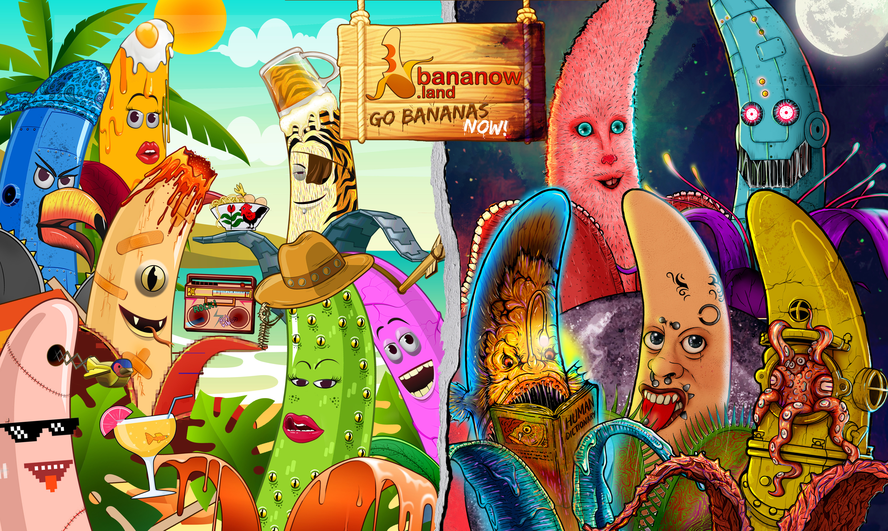

# 🍌 BANANOW NFTs

[**BANANOW BASED NFTs**](./) collection is a PFP-generated image of fun **BANANAS**, which aims to build [**a fun, non-intimidating, and supportive community**](../the-ecosystem/the-community/).

<figure><figcaption>
BANANOW NFTs
</figcaption></figure>


[the-information.md](the-information.md)



[the-allocation.md](the-allocation.md)



[the-utilities.md](the-utilities.md)



[the-roadmap.md](the-roadmap.md)


***
