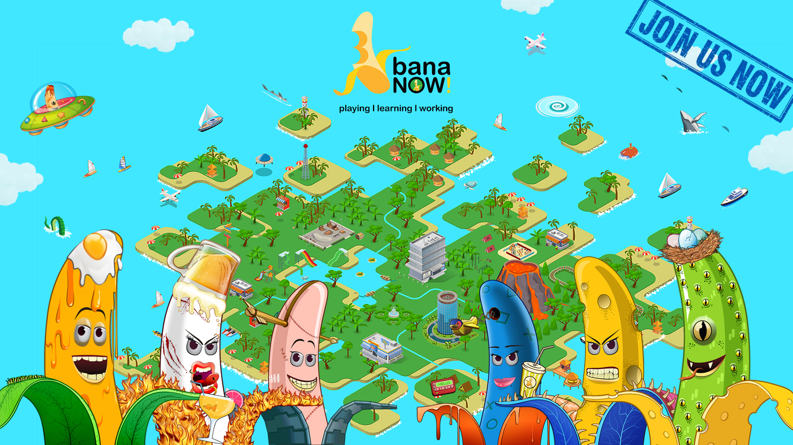

# 🍌 BANANOW.LAND

[**BANANOW.LAND**](https://bananow.endhonesa.com/)'s vision is to build [**a fun, healthy, and mutually supportive family**](../the-ecosystem/the-community/), in an organic way. [**BANANOW.LAND**](https://bananow.endhonesa.com/) is funded from the [**BANANOW NFTs**](../bananow-nfts/) collection, which has many usabilities for holders since it is the main token to access all privileges in [**BANANOW.LAND**](https://bananow.endhonesa.com/)'s ecosystem.

<figure><figcaption>
<strong>BANANOW.LAND</strong>
</figcaption></figure>

With a creative industry background from the founders, and with the help of web3 developers and marketers, [**BANANOW.LAND**](https://bananow.endhonesa.com/) is dedicated not just to supporting its family in creating, self-branding, and promoting, but also aims to develop the utilization of blockchain technology in a fun way.

The goal is to become a friendly bridge for people outside the web3 ecosystem to embrace and leverage blockchain technology. [**BANANOW.LAND**](https://bananow.endhonesa.com/) is your friendly neighborhood from web3.

Yes, we know, web3 this, web3 that, web3 her, web3 him, web3 they, what the freak is web3, right?

Take it easy, we're not going to push your limit knowing it, but we're here trying our best to show you that diving into the digital world can be as easy as peeling a **BANANA**.

Whether we're [**playing**](the-mission/playing.md), [**learning**](the-mission/learning.md), or [**working**](the-mission/working.md), together we've got your back. So, grab your lemon tea and join us for the most a-peeling adventure you'll ever have in the digital jungle!

Always embrace all sides of yourself!

Let’s have fun, grow, and thrive together, on-chain!

***
