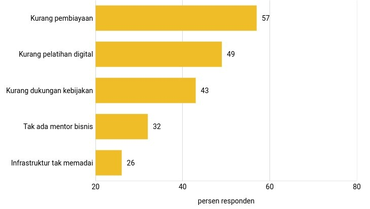

# 🍌 The Abstract

Building and developing a business is not easy for many creators and everyday people. Without a good strategy, the business can fail and even go bankrupt in the first few years.


According to [**Raymond Chin**](https://www.instagram.com/raymondchins/?hl=en), many businesses fail because of the lack of digitalization.


As customers, as users, we may be "**digital**", but in business terms, we don't understand it and not many people have gone digital.

Quoting from the [**Katadata**](https://katadata.co.id/) page, the reasons why businesses still find it difficult to carry out digital transformation are lack of financing, lack of digital training, lack of policy support, no business mentors, and inadequate infrastructure.

On the other side, the way the internet works right now is that creators and everyday people supply the content, and a few companies extract nearly all of the profits from it. Rules, algorithms, and payment structures change, which makes it hard for creators and everyday people to thrive in their creativity.

<figure><figcaption>
The reason why it is difficult for businesses to carry out digital transformation. Photo: <strong>Katadata</strong>
</figcaption></figure>

Knowing that many creators and everyday people need assistance in digital transformation, [**BANANOW.LAND**](https://bananow.endhonesa.com/) was created to help meet these needs. We think, that by [**playing**](bananow.land/the-mission/playing.md), [**learning**](bananow.land/the-mission/learning.md), and [**working**](bananow.land/the-mission/working.md) for our creativity, we deserve more control over our creativity to be built and developed as a business.

Moreover, today the industrial world has started to utilize web3 technology, namely blockchain and cryptocurrencies. By harnessing the power of web3 technology, the traditional middlemen controlling the internet are removed, creators and everyday people can have complete ownership of their original works and can build a direct connection between their business, its customers, and its users.

This [**Green Print**](./) aims to describe everything [**BANANOW.LAND**](https://bananow.endhonesa.com/) related – from its [**background**](bananow.land/the-background.md), [**mission**](bananow.land/the-mission/), and [**ecosystem**](the-ecosystem/), to existing [**features brands**](the-ecosystem/the-brands/), and [**the community**](the-ecosystem/the-community/).

Additionally, the [**Green Print**](./) also includes [**the NFTs**](bananow-nfts/) of the [**BANANOW.LAND**](https://bananow.endhonesa.com/), including but not limited to its [**information**](bananow-nfts/the-information.md), [**allocation**](bananow-nfts/the-allocation.md), [**utilities**](bananow-nfts/the-utilities.md), and [**roadmap**](bananow-nfts/the-roadmap.md).

***
